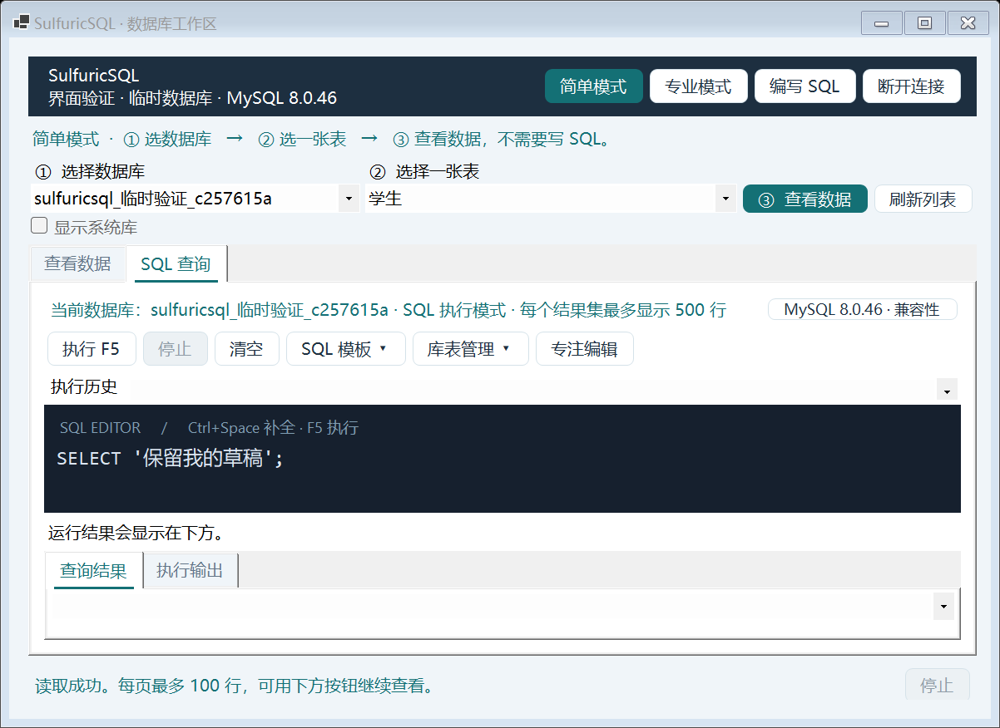
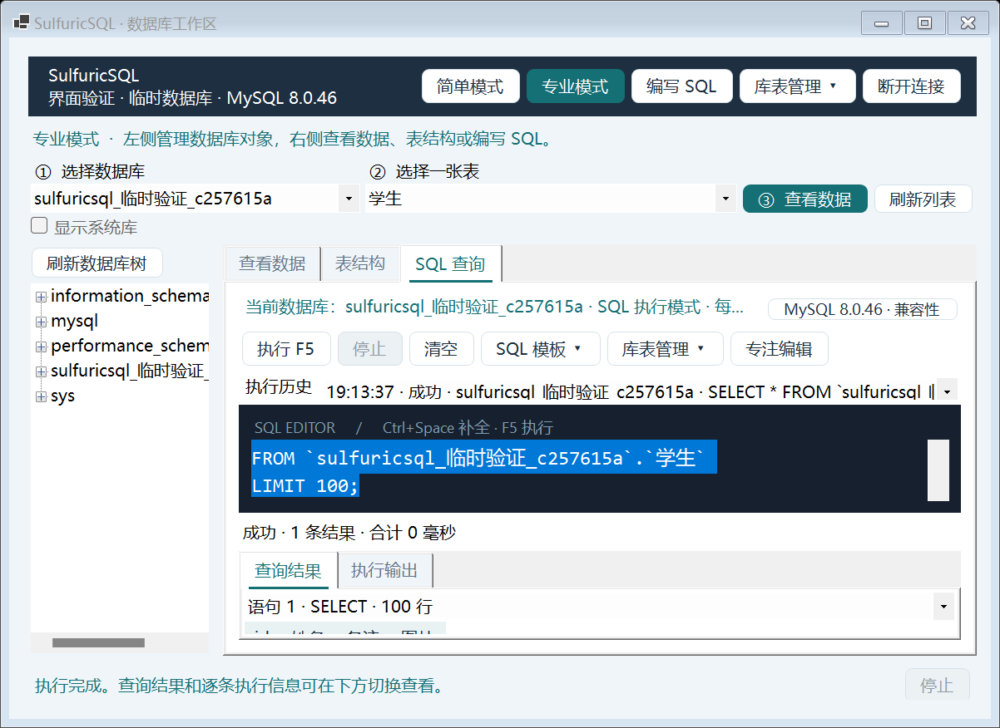

# SulfuricSQL · 简单模式 / 专业模式

用 C# WinForms 编写的 MySQL 学习客户端。连接之后默认进入简单模式，右上角随时切换专业模式。

## 打开程序

- 直接运行 `publish/SulfuricSQL.exe`。本机已经安装所需的 .NET 10 Windows 桌面运行时。
- 学习和修改代码：Visual Studio 打开 `SulfuricSQL.sln`，把 `SulfuricSQL` 设为启动项目，再按 F5。
- 命令行：在本目录执行 `dotnet run --project src/SulfuricSQL`。

连接时填写服务器地址、端口、MySQL 用户名和密码。程序不猜测账号，不保存密码文件；断开后返回连接界面。

## 简单模式：三步看到数据

1. **选数据库**：从上方第一个列表选择。默认隐藏 MySQL 的系统库；没有学习库时可勾选“显示系统库”。
2. **选一张表**：从第二个列表选择表或视图。
3. **查看数据**：点绿色按钮。每页最多 100 行，用“上一批 / 下一批”翻页。

想查找内容：选择在哪一列查找 → 输入内容 → 点“应用”。这是在数据库中查找，包含其他页的数据。输入中的 `%` 和 `_` 按普通文字匹配。

想调整顺序：选择排序列和“从小到大 / 从大到小”，再点“应用”。“清空条件”恢复默认顺序并回到第一页。

“刷新数据”保留已经应用的筛选条件，回到第一页；“刷新列表”重新获取数据库和表，并清空当前表显示。

NULL 显示为 `NULL`，二进制字段显示字节数。表格用于查看，不直接编辑数据。沒有主键的表会提示翻页顺序不稳定；其他程序同时修改数据时，分页结果也可能变化。



## 专业模式：数据库管理 + 表管理 + SQL

点击右上角“专业模式”，显示数据库树、表结构和 SQL 查询页。

- **数据库树**：选择数据库时会同步为当前数据库；展开数据库，双击表打开。右键数据库或表可打开管理菜单，右上角“库表管理”也提供同样的入口。
- **数据库管理**：创建、删除、查看属性、刷新，以及修改默认字符集和排序规则。字符集选项从当前服务器读取；修改默认值不会自动转换已经存在的表和列。
- **表管理**：用字段表格新建表，支持常用类型、长度、主键、NULL 和自增；也可查看数据、查看结构、重命名、清空、删除和刷新表。
- **表结构**：查看字段名、类型、是否允许 NULL、索引、默认值和说明。
- **SQL 查询**：多行编辑器支持查询、建库建表、修改结构、INSERT / UPDATE / DELETE / DROP / TRUNCATE。点击“执行”、按 F5 或 Ctrl+Enter；有选中内容时只运行选中部分，没有选中时按顺序执行整个编辑器中的脚本。`USE` 会同步当前数据库和界面选择。
- **执行输出**：查询数据用表格显示；多个结果集通过下拉列表切换。“执行输出”逐条显示 SQL、成功或失败、影响行数、耗时、MySQL 错误码、SQLSTATE 和原始错误信息。
- **模板与历史**：“SQL 模板”包含 SHOW DATABASES、CREATE DATABASE、USE、SHOW TABLES、DESCRIBE、CREATE TABLE、SELECT、INSERT、UPDATE、DELETE、DROP TABLE / DATABASE、TRUNCATE、SELECT VERSION、SHOW VARIABLES 和 EXPLAIN。模板与历史只插入编辑器并选中文本，不会自动执行。历史保留当前工作区最近 50 次执行，包括失败和取消，关闭工作区后清除。
- **生成查询示例**：在数据页点击该按钮，添加当前表的 `SELECT` 示例，自动切换到 SQL 页。已有草稿保留，新示例会被选中。
- **停止 / 清空**：“停止”取消当前执行并跳过后续语句；“清空”只清空编辑器。每个查询结果集最多显示 500 行，超过时有明确提示。

执行前会整体检查脚本。DROP、TRUNCATE 以及没有外层 WHERE 的 DELETE / UPDATE 需要再次确认；确认窗口显示起始数据库、风险和完整脚本，默认回车是“取消”。字符串、注释、子查询和 `@where` 变量不会被误当成外层 WHERE。取消确认后整段脚本都不执行。

禁止删除 `information_schema`、`mysql`、`performance_schema`、`sys` 系统数据库，包括 DROP SCHEMA 别名、大小写变体和批量脚本。菜单同样禁用系统库删除。

脚本逐句执行，遇到错误立即停止；已完成的语句不会自动撤销。MySQL 的建库、删库、清空表等 DDL 可能隐式提交，不能把“停止”理解成“撤销”。不支持 DELIMITER、存储程序、动态 SQL 和会话设置脚本；本轮没有增加 AI、ER 图、SSH 或用户权限管理。

切换模式保留当前表、当前页、查找条件和 SQL 草稿。切换数据库、刷新列表则重新开始选择表。关闭应用后不保存草稿，重要 SQL 请自行复制保存。



## 边做边理解：从这条流程开始

```text
用户点“应用”
    ↓
WorkspaceForm.Browsing.cs 读取界面中的查找条件
    ↓
BrowseOptions 保存条件
    ↓
DatabaseBrowserService 拼装查询结构，用参数传递查找文字
    ↓
MySQL 返回结果 → DataTable → DataGridView
```

两个模式共用连接和数据，不需要各写一套数据库逻辑。模式切换只是显示或隐藏数据库树、表结构和 SQL 页。

## 项目结构

以下路径均在 `src/SulfuricSQL/`：

| 文件 | 主要职责 |
| --- | --- |
| `Models/ConnectionSettings.cs` | 连接配置与输入检查 |
| `Models/BrowseOptions.cs` | 已应用的筛选和排序条件 |
| `Services/MySqlConnectionService.cs` | 连接、测试连接 |
| `Services/DatabaseBrowserService.cs` | 数据库树、表结构、筛选排序与分页 |
| `Services/DatabaseService.cs` | 管理 SQL 生成、建表字段校验、字符集和数据库属性 |
| `Services/SqlExecutionService.cs` | 逐句执行、查询结果、影响行数、耗时和异常 |
| `Services/SqlSafetyChecker.cs` | 分句、危险语句检查和系统数据库保护 |
| `Services/SqlTemplates.cs` | 常用 SQL 模板 |
| `Forms/WorkspaceForm.cs` | 模式切换、忙碌状态、连接生命周期 |
| `Forms/WorkspaceForm.Browsing.cs` | 选库、选表、查找和翻页事件 |
| `Forms/WorkspaceForm.Sql.cs` | SQL 草稿、示例、运行和停止事件 |
| `Forms/WorkspaceForm.Management.cs` | 库表管理菜单及树联动 |
| `Forms/ManagementDialogs.cs` | 建库建表、属性、重命名和危险操作确认窗口 |
| `Forms/WorkspaceForm.Layout.cs` | 工作区的控件与外观 |

先看按钮事件和 `DatabaseBrowserService`。查询检查器、取消和资源释放可以后面再学，不必一次看完。

## 验证

测试项目在 `tests/SulfuricSQL.SmokeTests`，需要独立临时 MySQL 实例。它会修改临时实例的 root 密码，绝不能对日常服务器运行。程序拒绝 3306 端口，但使用其他端口并不代表就是测试实例。

```text
dotnet run --project tests/SulfuricSQL.SmokeTests -c Release -- <临时实例端口> --ui-check
```

初始测试实例密码为空；再次运行时，环境变量 `SULFURICSQL_FIXTURE_PASSWORD` 应提供测试代码中定义的临时密码。`--ui-check` 在真正的 WinForms 消息循环中检查两种模式、筛选、翻页、草稿、选中查询和取消。测试仅创建随机命名的临时库，并在结束时删除该库。

可通过环境变量 `SULFURICSQL_PREVIEW_DIRECTORY` 保存界面渲染预览。加 `--preview` 会打开可交互的测试工作区，关闭后才清理临时库。

连接等待最多约 8 秒；专业 SQL 每条语句超时为 30 秒。每页限制行数，不限制单个字段的大小，超大 BLOB 仍可能占用较多内存。深分页使用 OFFSET，后续可再优化。专业模式当前没有语法高亮或自动补全。

管理测试已实际完成：创建数据库 → 创建表 → INSERT → SELECT → UPDATE → DELETE → DROP TABLE → DROP DATABASE，并验证字符集修改、属性、重命名、清空、危险操作取消、系统库保护、脚本出错停止和快捷键。测试采用独立临时实例，未修改本机原有数据库。

## 设计参考

参考 [Navicat 官方产品说明](https://www.navicat.com/en/products/navicat-for-mysql) 中可视化工具与 SQL 编辑器并列提供的思路，采用自己的三步操作界面。没有复制其图标、资源或内部实现。

连接与事务 API：[MySqlConnector 官方文档](https://mysqlconnector.net/tutorials/basic-api/)。

### SQL 编辑器与动画

两种模式均可点击“编写 SQL”，共享草稿和当前数据库。关键词蓝色、字符串橙色、注释绿色、数字浅绿色；配色不代表语法一定正确。输入两个字符后提示关键词；Ctrl+Space 手动提示，上下键选择，Tab/Enter 接受，Esc 关闭。F5 / Ctrl+Enter 执行，危险语句仍须确认。

“专注编辑”扩大编辑区；执行 SQL 会恢复结果区。窗口淡入、页签过渡及按钮反馈采用短缓动，并遵循 Windows 动画设置。原生下拉列表和滚动条保持 Windows 默认行为，不承诺 iOS 帧率。

补全目前使用本地关键词列表；超过 100000 字符暂停高亮。着色保留光标、滚动位置和文字撤销记录。

### 代码界面的库表管理与错误提示

SQL 工具栏也有“库表管理”，两种模式均可使用。补全在词已完整、没有匹配、输入空格/标点、移动光标或离开代码页时关闭。

例如把 SELECT 写成 SELETC，会显示红色文字和波浪线，悬停可查看建议，修正后自动清除。当前仅提供常见语句开头拼写错误和未闭合引号/注释检查；不会完整解析所有 MySQL 语法。数据库实际错误仍在执行输出中显示。

### 按服务器版本检查 SQL

代码页右上角显示当前版本，点击“兼容性”查看说明。执行时自动检查常见新旧版本差异：不支持或已经移除的语法阻止执行；仍能运行但已弃用的旧写法会提示，选择“仍然执行”才继续。普通通用 SQL 不会因为写法较旧就频繁弹窗。程序不会擅自改写你的 SQL。

兼容规则不是完整解析器，亦不支持将 SQL Server、SQLite 方言自动转换为 MySQL。低版本规则已测试，但当前实际服务器测试仅覆盖 MySQL 8.0.46；尚未完成 5.6、5.7、8.4 真实服务器验证。
